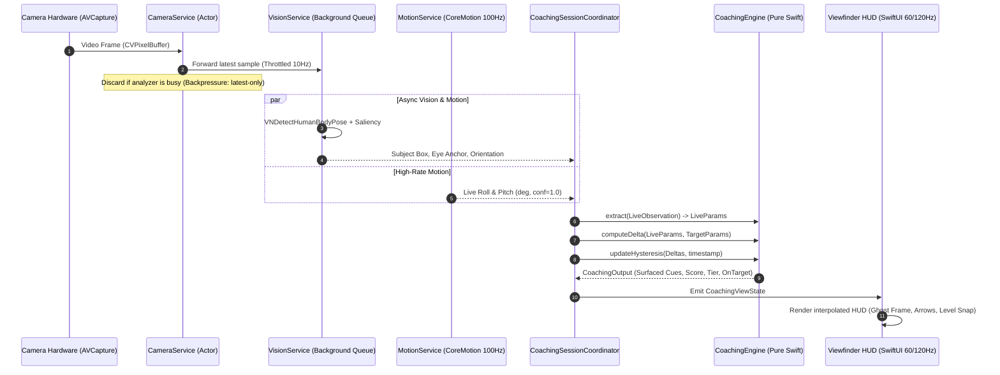

# Architecture Specification — Camsthetics (iOS)

**Document Version:** 1.0  
**Status:** Authoritative Foundation  
**Companion Documents:** `PRD.md`, `PRODUCT_SPEC.md`, `TECH_STACK.md`

---

## 1. Architectural Philosophy & Foundations

The Camsthetics iOS architecture is engineered from first principles around four non-negotiable architectural commitments:

1. **Pure Swift Coaching Domain Core:** The mathematical engine that performs aspect normalization, composition extraction, delta calculation, multi-layer hysteresis, and match scoring is built using **pure Swift value types with zero dependencies on UIKit, SwiftUI, AVFoundation, or Apple platform frameworks**. This enables instant, deterministic unit testing on macOS/Linux in milliseconds without simulators or devices.
2. **Asynchronously Decoupled Pipelines:** Viewfinder rendering ($60\text{–}120\text{Hz}$ ProMotion), sensor gravity polling ($60\text{–}100\text{Hz}$), and machine learning frame analysis ($8\text{–}15\text{Hz}$) run on independent, asynchronous execution contexts. Heavy inference never drops viewfinder frames.
3. **Unidirectional Data Flow (UDF):** All UI layers observe immutable state streams emitted by domain coordinators. State transitions are predictable, reproducible, and testable via state-replay traces.
4. **Image Fidelity Pipeline Separation:** The **analysis**, **preview**, and **capture** pipelines are architecturally distinct. Real-time analysis may sacrifice resolution and representation for performance; **final image capture may not sacrifice quality merely to simplify analysis**. Processing performed for analysis or UI must never become the source of the final saved photograph. This commitment is normative and is specified in §4.4 and `PRODUCT_SPEC.md` §1.8 (Group FIDELITY).

---

## 2. System Overview & Layered Architecture

```
┌─────────────────────────────────────────────────────────────────────────────┐
│                             PRESENTATION LAYER                              │
│       SwiftUI Views, Viewfinder HUD, Interactive Gestures, Review & History │
└──────────────────────────────────────┬──────────────────────────────────────┘
                                       │ Observes ViewState / Sends User Intents
                                       ▼
┌─────────────────────────────────────────────────────────────────────────────┐
│                            COORDINATION & DOMAIN                            │
│  • CoachingSessionCoordinator (Live Session State Machine)                  │
│  • TargetIngestCoordinator (Reference Normalization & Ingest)               │
│  • ReviewCoordinator (Post-Capture Analysis & History)                      │
└──────────────▲───────────────────────▲──────────────────────────────▲───────┘
               │                       │                              │
               │ Drives                │ Pure Math Calculations       │ Persists
               ▼                       ▼                              ▼
┌──────────────────────────┐ ┌───────────────────┐ ┌──────────────────────────┐
│     PLATFORM SERVICES    │ │  COACHING ENGINE  │ │   PERSISTENCE & SYSTEM   │
│ • CameraService (AVFound)│ │ (Pure Swift Value │ │ • TargetRepository       │
│ • VisionService (Vision) │ │  Types, Deltas,   │ │ • CaptureHistoryRepo     │
│ • MotionService (Motion) │ │  Hysteresis,      │ │ • LinkResolverService    │
│ • HapticService (Haptics)│ │  Score Math)      │ │ • PhotoLibraryService    │
└──────────────────────────┘ └───────────────────┘ └──────────────────────────┘
```

---

## 3. Module Boundaries & Responsibilities

### 3.1 Module Hierarchy

```
Camsthetics/
  ├── CamstheticsEngine/          (Pure Swift Package: Zero platform UI/AV dependencies)
  │     ├── Models/               (NormRect, NormPoint, CompositionParams, Delta, Instructions)
  │     ├── Extractor/            (Aspect normalizer, edge orientation, geometric estimators)
  │     ├── Delta/                (DeltaEngine, PriorityMapper, MagnitudeBucket)
  │     ├── Hysteresis/           (AntiFlickerFilter, DwellTimer, TierResolver)
  │     └── Scoring/              (GaussianMatchScorer, OnTargetGate)
  │
  ├── CamstheticsServices/        (Platform Integration Services & Adapters)
  │     ├── Camera/               (AVCaptureSession controller, Lens/Exposure manager)
  │     │     ├── Capture/        (AVCapturePhotoOutput — native photo path; owns capture quality)
  │     │     ├── Analysis/       (AVCaptureVideoDataOutput — downsampled analysis frames only)
  │     │     └── Preview/        (AVCaptureVideoPreviewLayer binding — display only)
  │     ├── Vision/               (Apple Vision adapters, Saliency & Body Pose detectors)
  │     ├── Motion/               (CoreMotion gravity & roll/pitch provider)
  │     ├── Haptics/              (CoreHaptics & UIFeedbackGenerator engine)
  │     ├── Storage/              (SwiftData/SQLite entities, file manager for captures)
  │     └── Ingest/               (oEmbed parser, OpenGraph stream resolver)
  │
  ├── CamstheticsUI/              (SwiftUI Components & Design System)
  │     ├── DesignSystem/         (Apple Materials, Typography, SF Symbols, Colors)
  │     ├── Viewfinder/           (Metal/AVPreview wrapper, Reticle, Horizon Level, HUD)
  │     ├── Controls/             (Lens pill, Shutter button, Mode carousel, Sliders)
  │     └── Overlays/             (Ghost silhouette, Directional arrow capsules, Score badge)
  │
  └── CamstheticsApp/             (App Root, App Coordinator, Share Extension)
        ├── Navigation/           (Root view routing, modal sheet coordinator)
        └── Composition/          (Dependency Injection Container, App Lifecycle)
```

### 3.2 Dependency Direction Rules
* `CamstheticsEngine` **must never import** `UIKit`, `SwiftUI`, `AVFoundation`, `Vision`, `CoreMotion`, or `CoreData`.
* `CamstheticsServices` depends on `CamstheticsEngine` (for domain models).
* `CamstheticsUI` depends on `CamstheticsEngine` and design system tokens.
* `CamstheticsApp` acts as the composition root, wiring services into domain coordinators.

#### Image Fidelity Dependency Rules (Normative)
* The **capture path owns capture quality.** No type outside `Camera/Capture/` may configure photo output format, dimensions, colour space, or quality prioritization.
* **No buffer produced by `Camera/Analysis/` or `Camera/Preview/` may reach `PhotoLibraryService`.** The only permitted source of a saved photograph is the photo capture output.
* `VisionService` consumes analysis representations only; it has **no reference** to the photo output and cannot influence its configuration.
* Any type that performs a pixel-format or colour conversion must declare which pipeline it belongs to; conversions are prohibited from crossing pipelines (see §4.4).

---

## 4. Subsystem Pipelines

> **§4.4 (Image Fidelity Pipeline Separation) governs every pipeline in this section.** The analysis pipeline described in §4.1 is a *consumer* of camera frames, never the source of the saved photograph.

### 4.1 Live Camera & Analysis Pipeline



#### Backpressure & Monotonic Throttle
* Camera outputs video frames at $30\text{–}60\text{fps}$.
* An atomic `isProcessing` gate ensures the analysis queue holds **at most one frame in flight**.
* Any arriving frame while processing is busy is closed and released immediately to prevent latency backlog.
* Motion attitude is sampled at $100\text{Hz}$ and merged with the latest vision observation at the instant of evaluation.

---

### 4.2 Machine Learning & Vision Pipeline

* **Primary Subject Detection:** Uses Apple `VNGenerateAttentionBasedSaliencyImageRequest` + `VNRecognizeAnimalsRequest` / custom CoreML subject classifier.
* **Human Body Pose & Eye-Line Anchor:** Uses `VNDetectHumanBodyPoseRequest`. When a person is detected, the eye-line midpoint (`left_eye`, `right_eye`) serves as the composition anchor point instead of bounding box center.
* **Target Sobel Edge & Tilt Extractor:** Pure Swift image kernel running over a downscaled grayscale `CGImage` ($\le 256\text{px}$) to compute gradient orientation histograms without external C++ or OpenCV dependencies.

---

### 4.3 Persistence & Ingestion Architecture

```
[ Ingestion Sources ]
  • Share Extension
  • Clipboard Link
  • PhotosPicker (PHPicker)
  • Curated Preset Pack
        │
        ▼
[ TargetIngestCoordinator ]
        │
        ├─► Aspect Normalization & Feature Extraction (Target CompositionParams)
        ├─► Write Cached Master Image (`/Application Support/Targets/<hash>.jpg`)
        └─► Persist Metadata Entity in SwiftData / Local DB
```

* **Session History Storage:**
  * Stores `CaptureSessionEntity`: `sessionId`, `targetId`, `scoreAtCapture`, `bestScore`, `capturedImagePath`, `finalDelta`, `timestamp`.
  * Captures are written via `PhotoKit` directly to the user's Camera Roll.
  * Local cache is pruned to the most recent 200 sessions.

---

### 4.4 Image Fidelity Pipeline Separation (Normative)

**Mandatory architectural rule:**

> **"Real-time analysis may sacrifice resolution and representation for performance; final image capture may not sacrifice quality merely to simplify analysis."**

The architecture maintains this conceptual separation:

```
                 CAMERA
                    │
          ┌─────────┴─────────┐
          │                   │
          ▼                   ▼
    ANALYSIS PATH         CAPTURE PATH
          │                   │
   Vision / CV / ML      Native Photo Capture
          │                   │
   Lower-res allowed      Highest-quality
          │               supported path
          │                   │
          ▼                   ▼
     COACHING UI          FINAL PHOTO
```

The preview path is a third consumer of the same camera input, feeding the viewfinder only:

```
   AVCaptureSession (single camera input, shared)
          │
          ├──► AVCaptureVideoDataOutput ──► analysis frame ──► Vision / CoachingEngine ──► COACHING UI
          │         (downsampled, converted, throttled, discardable)
          │
          ├──► AVCaptureVideoPreviewLayer ──► preview frame ──► VIEWFINDER
          │         (display only; never persisted, never analysed as capture)
          │
          └──► AVCapturePhotoOutput ──────► captured photo ──► PhotoKit ──► FINAL PHOTO
                    (highest-quality supported native path; independent configuration)
```

#### 4.4.1 Pipeline Contracts

| Pipeline | Owner | Optimizes For | May Degrade? | Reaches Disk? |
|---|---|---|---|---|
| **Analysis** | `Camera/Analysis/` → `VisionService` | Latency, thermal budget | **Yes — by design** | **Never** (volatile buffers only, per `PRODUCT_SPEC.md` §1.7) |
| **Preview** | `Camera/Preview/` → `CamstheticsUI/Viewfinder` | Responsiveness, low latency, stable frame rate, correct orientation and aspect | Presentation only | **Never** |
| **Capture** | `Camera/Capture/` → `PhotoLibraryService` | **Image quality** | **No** | Yes — the only path that does |

#### 4.4.2 Analysis Pipeline (Permitted Latitude)
The analysis pipeline is designed for efficient real-time processing and **may** downsample frames, use lower-resolution representations, convert pixel formats when required, use Vision / Accelerate / Metal, perform computer-vision processing, discard frames, process asynchronously, and throttle frame rate (§4.1 backpressure model).

**Boundary:** analysis representations are *temporary processing inputs*. They are **not** the final photograph, and the analysis pipeline **must never force the capture pipeline to use its degraded representation**. If a lower-resolution or converted buffer is created for Vision/coaching, the original high-quality capture path remains independent of it.

#### 4.4.3 Preview Pipeline
Prioritizes responsiveness, low latency, stable frame rate, correct orientation, correct aspect ratio, and accurate composition representation. **Preview processing must not dictate the quality of the final captured image**, and no image conversion may be introduced merely to support the preview UI. Preview FOV/crop differences relative to capture are measured and reconciled rather than assumed (see `PRODUCT_SPEC.md` FIDELITY-10).

#### 4.4.4 Capture Pipeline
The highest-priority image-quality path. It uses Apple's highest-quality supported capture configuration appropriate for the target device and the product's requirements, resolved by **runtime capability query** rather than assumption (device formats, supported photo dimensions, supported codecs, HDR/wide-colour support, stabilization modes).

* **The capture path is not designed around the requirements of Vision or real-time coaching.**
* Apple's native photo capture pipeline and supported computational photography capabilities are preferred over reconstructing a photograph from processed video frames.
* Capture configuration is stated in terms of intent (maximum supported photo dimensions, quality prioritization, native colour/HDR characteristics preserved); the concrete API surface is version-dependent and is pinned during Phase 2.0 on device. On iOS 17+, maximum-resolution intent is expressed through the current photo-dimensions API on `AVCapturePhotoOutput` / `AVCaptureDevice.activeFormat` rather than the older boolean high-resolution flag referenced in `PRODUCT_SPEC.md` §1.5; the *intent* (full native sensor resolution, no re-encode) is unchanged.

#### 4.4.5 Conversion & Resolution Rules
* **Prohibited chain when it exists only to serve analysis:** `camera YUV → RGB → resized RGB → JPEG → saved photo`.
* Use native camera/output formats wherever practical. Where Vision requires a conversion, create a **separate** processing representation, preserve the original capture path, document the necessity, and never feed the converted representation back into capture. Any lossy conversion must be explicitly justified.
* **Analysis resolution and capture resolution are independent concerns.** Capture resolution is never reduced because analysis runs lower.
* **Analysis colour representation and final capture representation are independent concerns.** An SDR/RGB analysis path must not cause an HDR/wide-colour capture to be flattened or tone-mapped.

#### 4.4.6 Engine Impact
`CamstheticsEngine` (Phase 1) is unaffected by this separation: it is geometry-pure and consumes normalized `CompositionParams` regardless of their origin. The **services layer** is responsible for supplying parameters referenced to the *captured* image geometry, so the coaching coordinate system and the saved photograph agree (FIDELITY-10). No engine change is required by this specification.

---

## 5. Concurrency, Threading & Memory Architecture

```
┌─────────────────────────────────────────────────────────────────────────────┐
│                          THREADING & ISOLATION MODEL                        │
├─────────────────────────────────────────────────────────────────────────────┤
│  @MainActor                  UI Layer (SwiftUI View Hierarchy, Gestures)    │
│                                                                             │
│  actor CameraService         AVCaptureSession management, Photo output      │
│                                                                             │
│  actor VisionService         Vision Request execution, CoreML inference     │
│                                                                             │
│  actor StorageService        SwiftData / SQLite transactions, Disk I/O      │
│                                                                             │
│  CoachingEngine              Pure synchronous functions (Thread-agnostic)   │
└─────────────────────────────────────────────────────────────────────────────┘
```

* **Zero Frame Allocation in Live Loop:** Reusable pixel buffer pools and vector math buffers ensure the continuous $10\text{Hz}$ coaching loop produces zero steady-state heap garbage.
* **Thermal Management:** Observes `ProcessInfo.thermalStateDidChangeNotification`. Under `.serious` or `.critical` thermal pressure, analysis rate dynamically drops from $10\text{Hz} \to 5\text{Hz}$, or gracefully degrades to sensor-only spirit leveling.

---

## 6. Testing & Quality Strategy

### 6.1 Test Boundaries

| Test Suite | Execution Target | Scope | Target Execution Time |
|---|---|---|---|
| **Coaching Engine Unit Tests** | macOS / Linux JVM-speed | Geometry math, aspect normalization, sign-error regression table (20+ cases), property tests (monotonic scoring), hysteresis timing. | $< 100\text{ms}$ |
| **Service Mock Tests** | Unit Test Runner | Ingestion link parsers (oEmbed, OpenGraph fallback), Storage cascade deletes, Coordinator state machines with mocked Camera/Vision. | $< 1.5\text{s}$ |
| **Snapshot & UI Tests** | iOS Simulator | Viewfinder layout, lens switch transitions, drag-to-compare wipe divider, dark mode contrast. | $< 15\text{s}$ |
| **Performance & Latency** | Physical Device | Motion-to-overlay latency ($< 50\text{ms}$), frame processing time ($< 45\text{ms}$ p95 on iPhone 13+), thermal endurance. | Manual Phase Exit |
| **Image Quality Validation** | **Physical Device Only** | Capture fidelity vs. Apple's native capture path across resolution, detail, noise, dynamic range, colour, HDR, FOV, crop, orientation, stabilization, metadata, format, file size, latency (`PRODUCT_SPEC.md` FIDELITY-11). | Manual Phase Exit |

### 6.2 Image Quality Validation (Physical Device Only)

* **The Simulator must not be used for camera or image-quality validation** — it provides no camera hardware, no computational photography pipeline, and no representative capture characteristics. No Simulator-based camera test is to be added to the test strategy.
* **Validation devices:** iPhone 14 and iPhone 16 (where available).
* **Development/validation path:** Windows host → macOS VM → Xcode → physical iPhone over USB passthrough.
* **Comparison basis:** Camsthetics captures vs. the highest-quality appropriate capture path available through Apple's native APIs, same scene and conditions, back-to-back.
* **Reporting rule:** measurable differences are documented (dimensions, format, byte size, metadata diff, latency at minimum). A capture is never declared "native-quality" on the basis that it looks acceptable.
