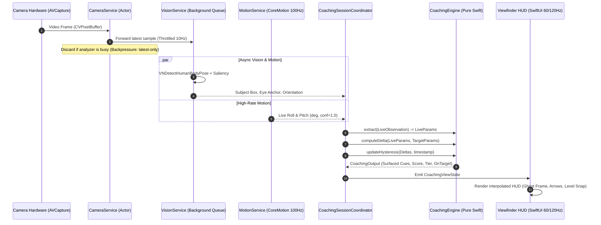

# Architecture Specification — Camsthetics (iOS)

**Document Version:** 1.0  
**Status:** Authoritative Foundation  
**Companion Documents:** `PRD.md`, `PRODUCT_SPEC.md`, `TECH_STACK.md`

---

## 1. Architectural Philosophy & Foundations

The Camsthetics iOS architecture is engineered from first principles around three non-negotiable architectural commitments:

1. **Pure Swift Coaching Domain Core:** The mathematical engine that performs aspect normalization, composition extraction, delta calculation, multi-layer hysteresis, and match scoring is built using **pure Swift value types with zero dependencies on UIKit, SwiftUI, AVFoundation, or Apple platform frameworks**. This enables instant, deterministic unit testing on macOS/Linux in milliseconds without simulators or devices.
2. **Asynchronously Decoupled Pipelines:** Viewfinder rendering ($60\text{–}120\text{Hz}$ ProMotion), sensor gravity polling ($60\text{–}100\text{Hz}$), and machine learning frame analysis ($8\text{–}15\text{Hz}$) run on independent, asynchronous execution contexts. Heavy inference never drops viewfinder frames.
3. **Unidirectional Data Flow (UDF):** All UI layers observe immutable state streams emitted by domain coordinators. State transitions are predictable, reproducible, and testable via state-replay traces.

---

## 2. System Overview & Layered Architecture

```
┌─────────────────────────────────────────────────────────────────────────────┐
│                             PRESENTATION LAYER                              │
│       SwiftUI Views, Viewfinder HUD, Interactive Gestures, Review & History │
└──────────────────────────────────────┬──────────────────────────────────────┘
                                       │ Observes ViewState / Sends User Intents
                                       ▼
┌─────────────────────────────────────────────────────────────────────────────┐
│                            COORDINATION & DOMAIN                            │
│  • CoachingSessionCoordinator (Live Session State Machine)                  │
│  • TargetIngestCoordinator (Reference Normalization & Ingest)               │
│  • ReviewCoordinator (Post-Capture Analysis & History)                      │
└──────────────▲───────────────────────▲──────────────────────────────▲───────┘
               │                       │                              │
               │ Drives                │ Pure Math Calculations       │ Persists
               ▼                       ▼                              ▼
┌──────────────────────────┐ ┌───────────────────┐ ┌──────────────────────────┐
│     PLATFORM SERVICES    │ │  COACHING ENGINE  │ │   PERSISTENCE & SYSTEM   │
│ • CameraService (AVFound)│ │ (Pure Swift Value │ │ • TargetRepository       │
│ • VisionService (Vision) │ │  Types, Deltas,   │ │ • CaptureHistoryRepo     │
│ • MotionService (Motion) │ │  Hysteresis,      │ │ • LinkResolverService    │
│ • HapticService (Haptics)│ │  Score Math)      │ │ • PhotoLibraryService    │
└──────────────────────────┘ └───────────────────┘ └──────────────────────────┘
```

---

## 3. Module Boundaries & Responsibilities

### 3.1 Module Hierarchy

```
Camsthetics/
  ├── CamstheticsEngine/          (Pure Swift Package: Zero platform UI/AV dependencies)
  │     ├── Models/               (NormRect, NormPoint, CompositionParams, Delta, Instructions)
  │     ├── Extractor/            (Aspect normalizer, edge orientation, geometric estimators)
  │     ├── Delta/                (DeltaEngine, PriorityMapper, MagnitudeBucket)
  │     ├── Hysteresis/           (AntiFlickerFilter, DwellTimer, TierResolver)
  │     └── Scoring/              (GaussianMatchScorer, OnTargetGate)
  │
  ├── CamstheticsServices/        (Platform Integration Services & Adapters)
  │     ├── Camera/               (AVCaptureSession controller, Lens/Exposure manager)
  │     ├── Vision/               (Apple Vision adapters, Saliency & Body Pose detectors)
  │     ├── Motion/               (CoreMotion gravity & roll/pitch provider)
  │     ├── Haptics/              (CoreHaptics & UIFeedbackGenerator engine)
  │     ├── Storage/              (SwiftData/SQLite entities, file manager for captures)
  │     └── Ingest/               (oEmbed parser, OpenGraph stream resolver)
  │
  ├── CamstheticsUI/              (SwiftUI Components & Design System)
  │     ├── DesignSystem/         (Apple Materials, Typography, SF Symbols, Colors)
  │     ├── Viewfinder/           (Metal/AVPreview wrapper, Reticle, Horizon Level, HUD)
  │     ├── Controls/             (Lens pill, Shutter button, Mode carousel, Sliders)
  │     └── Overlays/             (Ghost silhouette, Directional arrow capsules, Score badge)
  │
  └── CamstheticsApp/             (App Root, App Coordinator, Share Extension)
        ├── Navigation/           (Root view routing, modal sheet coordinator)
        └── Composition/          (Dependency Injection Container, App Lifecycle)
```

### 3.2 Dependency Direction Rules
* `CamstheticsEngine` **must never import** `UIKit`, `SwiftUI`, `AVFoundation`, `Vision`, `CoreMotion`, or `CoreData`.
* `CamstheticsServices` depends on `CamstheticsEngine` (for domain models).
* `CamstheticsUI` depends on `CamstheticsEngine` and design system tokens.
* `CamstheticsApp` acts as the composition root, wiring services into domain coordinators.

---

## 4. Subsystem Pipelines

### 4.1 Live Camera & Analysis Pipeline



#### Backpressure & Monotonic Throttle
* Camera outputs video frames at $30\text{–}60\text{fps}$.
* An atomic `isProcessing` gate ensures the analysis queue holds **at most one frame in flight**.
* Any arriving frame while processing is busy is closed and released immediately to prevent latency backlog.
* Motion attitude is sampled at $100\text{Hz}$ and merged with the latest vision observation at the instant of evaluation.

---

### 4.2 Machine Learning & Vision Pipeline

* **Primary Subject Detection:** Uses Apple `VNGenerateAttentionBasedSaliencyImageRequest` + `VNRecognizeAnimalsRequest` / custom CoreML subject classifier.
* **Human Body Pose & Eye-Line Anchor:** Uses `VNDetectHumanBodyPoseRequest`. When a person is detected, the eye-line midpoint (`left_eye`, `right_eye`) serves as the composition anchor point instead of bounding box center.
* **Target Sobel Edge & Tilt Extractor:** Pure Swift image kernel running over a downscaled grayscale `CGImage` ($\le 256\text{px}$) to compute gradient orientation histograms without external C++ or OpenCV dependencies.

---

### 4.3 Persistence & Ingestion Architecture

```
[ Ingestion Sources ]
  • Share Extension
  • Clipboard Link
  • PhotosPicker (PHPicker)
  • Curated Preset Pack
        │
        ▼
[ TargetIngestCoordinator ]
        │
        ├─► Aspect Normalization & Feature Extraction (Target CompositionParams)
        ├─► Write Cached Master Image (`/Application Support/Targets/<hash>.jpg`)
        └─► Persist Metadata Entity in SwiftData / Local DB
```

* **Session History Storage:**
  * Stores `CaptureSessionEntity`: `sessionId`, `targetId`, `scoreAtCapture`, `bestScore`, `capturedImagePath`, `finalDelta`, `timestamp`.
  * Captures are written via `PhotoKit` directly to the user's Camera Roll.
  * Local cache is pruned to the most recent 200 sessions.

---

## 5. Concurrency, Threading & Memory Architecture

```
┌─────────────────────────────────────────────────────────────────────────────┐
│                          THREADING & ISOLATION MODEL                        │
├─────────────────────────────────────────────────────────────────────────────┤
│  @MainActor                  UI Layer (SwiftUI View Hierarchy, Gestures)    │
│                                                                             │
│  actor CameraService         AVCaptureSession management, Photo output      │
│                                                                             │
│  actor VisionService         Vision Request execution, CoreML inference     │
│                                                                             │
│  actor StorageService        SwiftData / SQLite transactions, Disk I/O      │
│                                                                             │
│  CoachingEngine              Pure synchronous functions (Thread-agnostic)   │
└─────────────────────────────────────────────────────────────────────────────┘
```

* **Zero Frame Allocation in Live Loop:** Reusable pixel buffer pools and vector math buffers ensure the continuous $10\text{Hz}$ coaching loop produces zero steady-state heap garbage.
* **Thermal Management:** Observes `ProcessInfo.thermalStateDidChangeNotification`. Under `.serious` or `.critical` thermal pressure, analysis rate dynamically drops from $10\text{Hz} \to 5\text{Hz}$, or gracefully degrades to sensor-only spirit leveling.

---

## 6. Testing & Quality Strategy

### 6.1 Test Boundaries

| Test Suite | Execution Target | Scope | Target Execution Time |
|---|---|---|---|
| **Coaching Engine Unit Tests** | macOS / Linux JVM-speed | Geometry math, aspect normalization, sign-error regression table (20+ cases), property tests (monotonic scoring), hysteresis timing. | $< 100\text{ms}$ |
| **Service Mock Tests** | Unit Test Runner | Ingestion link parsers (oEmbed, OpenGraph fallback), Storage cascade deletes, Coordinator state machines with mocked Camera/Vision. | $< 1.5\text{s}$ |
| **Snapshot & UI Tests** | iOS Simulator | Viewfinder layout, lens switch transitions, drag-to-compare wipe divider, dark mode contrast. | $< 15\text{s}$ |
| **Performance & Latency** | Physical Device | Motion-to-overlay latency ($< 50\text{ms}$), frame processing time ($< 45\text{ms}$ p95 on iPhone 13+), thermal endurance. | Manual Phase Exit |
